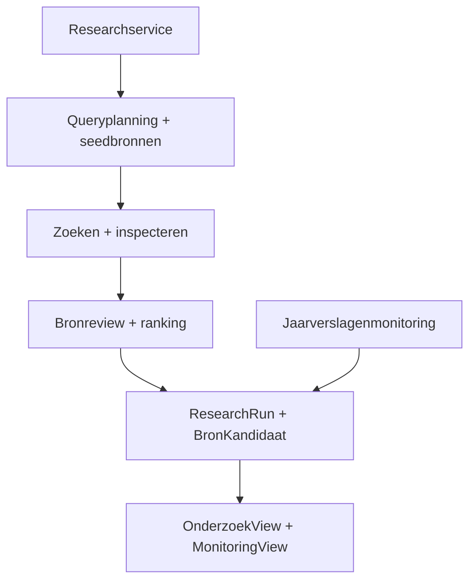
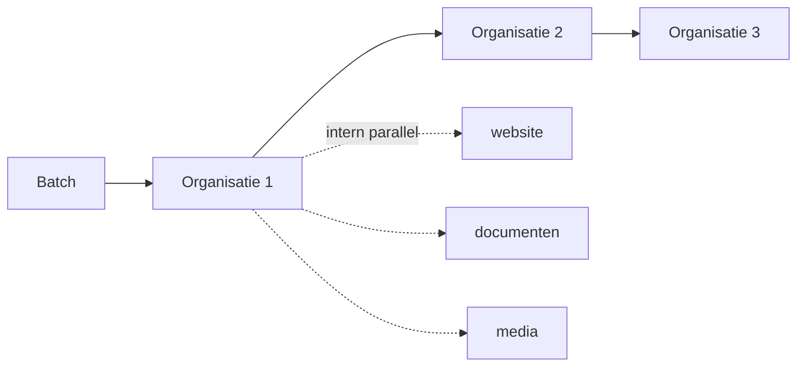
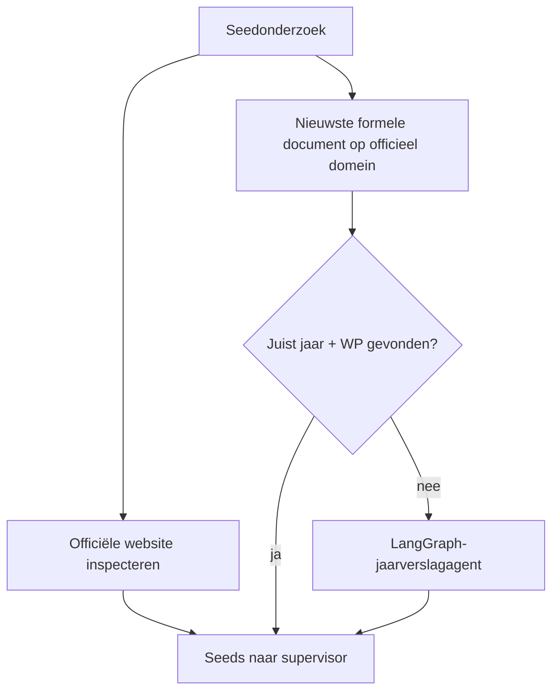
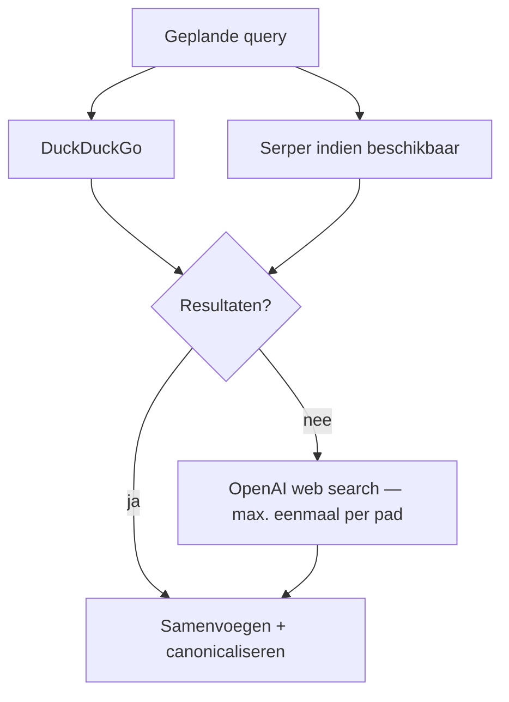
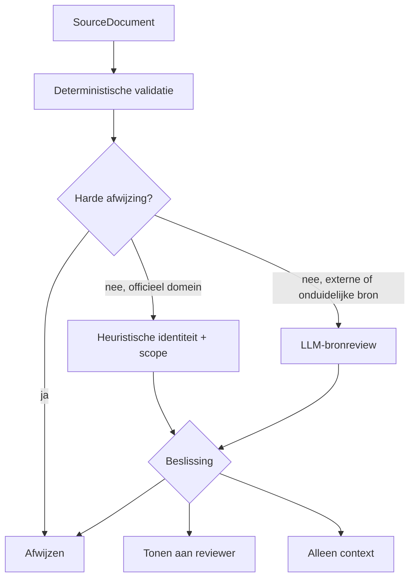
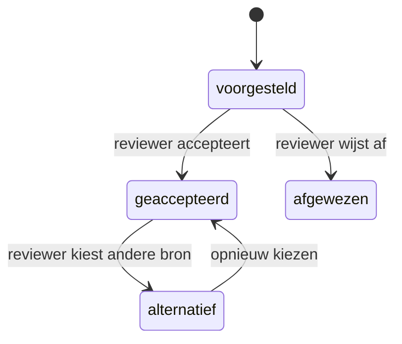
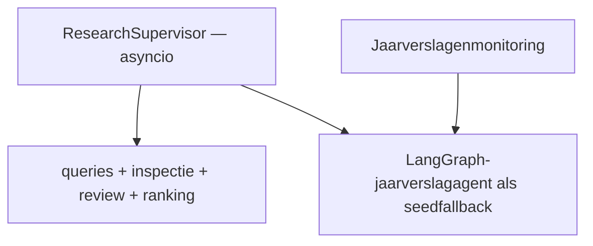
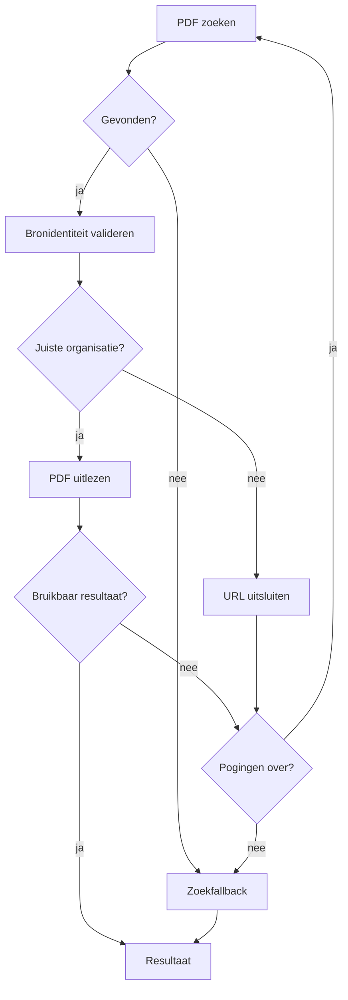
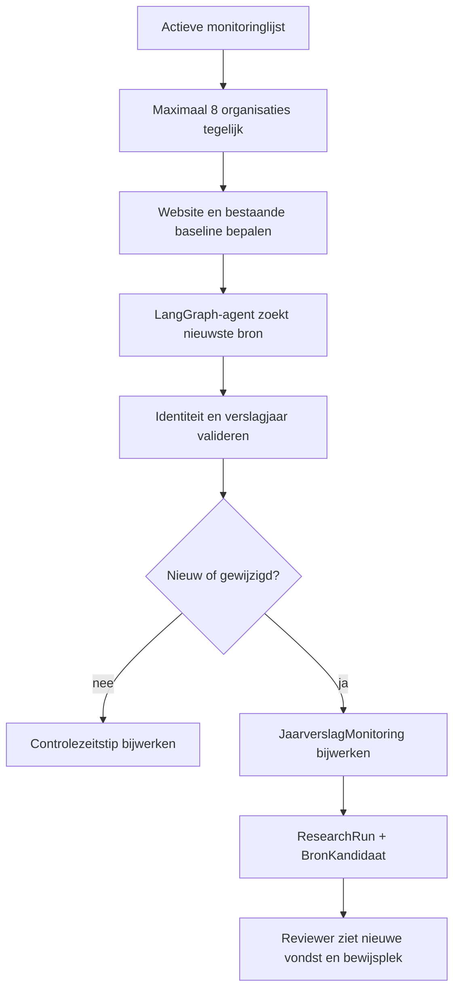

# Vestigingsregister — zo werkt het onderzoek

Deze repository ondersteunt reviewers bij het vinden en controleren van openbare
bronnen over **Werkzame Personen (WP)** voor het Vestigingsregister van Provincie
Limburg. De software neemt geen definitieve registerbeslissing: zij zoekt,
inspecteert en rangschikt bewijs; een reviewer kiest de bron.

Lees deze README als rondleiding door de uitvoerbare flow. Installatie en deploy
staan bewust onderaan.

## De applicatie in één minuut

```mermaid
flowchart LR
    A["CSV of Excel"] --> B["Batch met organisaties"]
    B --> C["ResearchRun per organisatie"]
    C --> D["Website, documenten en media zoeken"]
    D --> E["Pagina's en PDF's inspecteren"]
    E --> F["Identiteit, scope en bewijs valideren"]
    F --> G["Bronnen rangschikken"]
    G --> H["BronKandidaat opslaan"]
    H --> I["Reviewer accepteert of wijst af"]
```



Vier regels bepalen vrijwel alle keuzes in de code:

1. **FTE is geen WP.** Een FTE-getal blijft als FTE zichtbaar en wordt nooit
   stilzwijgend omgerekend.
2. **Scope is essentieel.** Een concern- of landelijk getal kan context zijn,
   maar is geen vestigingswaarde.
3. **De bron moet bij de juiste organisatie horen.** Onzekere identiteit wordt
   fail-closed afgewezen.
4. **De mens beslist.** Een researchrun maakt bronkandidaten, geen definitieve
   registerwaarde.

## De actieve architectuur



Bronfunctionaliteit hoort in `backend/app/research/`. Zowel breed onderzoek als
jaarverslagenmonitoring levert `ResearchRun`- en `BronKandidaat`-records aan
dezelfde reviewinterface.

## Stap 1 — een batch wordt onderzoek

Een reviewer uploadt een CSV- of Excel-bestand. De backend maakt één `Batch` en
één `Company` per rij. Daarna start:

```http
POST /batches/{batch_id}/run
```

`backend/app/routers/batches.py` plant `run_research_batch()` als
achtergrondtaak. Die verwerkt organisaties **sequentieel** om API-budgetten en
belasting te begrenzen. Binnen één organisatie lopen onafhankelijke zoek- en
inspectietaken juist **parallel**.



Voor iedere organisatie ontstaat een `ResearchRun`. Bij registerjaar 2026 zoekt
de batch standaard naar verslagjaar 2025 (`batch.jaar - 1`). Een individuele
researchrun heeft een timeout van 300 seconden.

## Stap 2 — de organisatiecontext wordt opgebouwd

De researchservice verzamelt:

- organisatienaam;
- gemeente;
- gevraagd verslagjaar;
- bekende officiële website.

De website komt eerst uit `Company.website_url`, daarna uit `Enrichment`. Alleen
in live-modus probeert `LivePlacesProvider` een ontbrekende website op te lossen.
Een gevonden website wordt opgeslagen voor volgende runs.

De databaseverbinding wordt vóór de lange netwerkfase gesloten. Research houdt
daardoor niet minutenlang een SQLAlchemy-sessie bezet.

## Stap 3 — sterke seedbronnen krijgen voorrang

Voordat de brede zoeklaag begint, verzamelt `research/seeds.py` kansrijke
startdocumenten:



De officiële website en het nieuwste formele document worden parallel gezocht.
De gespecialiseerde jaarverslagagent draait alleen als het officiële document
niet tegelijk het gevraagde jaar én een echt WP-getal bevat. Een FTE-getal is
dus geen reden om de verdere jaarverslagzoektocht over te slaan.

De documentzoeker probeert naast site-scoped queries ook gangbare publicatiepaden
zoals `/jaarverslag`, `/jaarverslagen` en `/publicaties`.

## Stap 4 — de queryplanner maakt drie onderzoekspaden

`research/query_planner.py` maakt maximaal twaalf korte, deterministische
queries. De breedte zit in het aantal queries, niet in lange zoekzinnen vol
synoniemen.

Voor een fictieve organisatie `Voorbeeld Zorg Maastricht`, domein
`voorbeeldzorg.nl`, verslagjaar 2025 ontstaan bijvoorbeeld:

### Website

```text
site:voorbeeldzorg.nl medewerkers team
site:voorbeeldzorg.nl over ons organisatie
Voorbeeld Zorg Maastricht medewerkers team
```

Administratieve woorden zoals `vestiging`, `filiaal` of `locatie` kunnen worden
verwijderd voor een aanvullende zoekalias.

### Documenten

```text
site:voorbeeldzorg.nl jaarverslag 2025
Voorbeeld Zorg Maastricht jaarverslag pdf
Voorbeeld Zorg Maastricht jaarrekening 2025
Voorbeeld Zorg Maastricht jaarstukken filetype:pdf
Voorbeeld Zorg Maastricht annual report pdf
Voorbeeld Zorg Maastricht jaarverslag gepubliceerd 2026
```

Een verslag over jaar N verschijnt vaak pas in N+1; daarom zijn verslagjaar en
publicatiejaar aparte signalen.

### Recente media

```text
Voorbeeld Zorg Maastricht nieuws medewerkers 2026
Voorbeeld Zorg Maastricht reorganisatie overname
```

Media kunnen groei, krimp, fusie of overname signaleren waardoor een formeel
cijfer aanvullende context nodig heeft.

## Stap 5 — zoeken met begrensde fallbacks

Alle geplande queries worden parallel uitgevoerd. In live-modus combineert de
zoeklaag DuckDuckGo met Serper wanneer een key beschikbaar is. Resultaten van
verschillende providers worden op canonieke URL samengevoegd; trackingparameters
en fragmenten tellen niet mee voor deduplicatie.

Als klassieke zoekproviders voor een onderzoekspad niets opleveren, gebruikt
`LiveResearchTools` OpenAI hosted web search. De fallback wordt per pad gecachet,
zodat meerdere lege queries niet ieder een betaalde fallback veroorzaken.



## Stap 6 — het paginabudget blijft verdeeld

Een query kan meerdere resultaten leveren, maar de supervisor inspecteert
standaard maximaal vijftien brede zoekresultaten. Bij een officiële bron uit het
gevraagde jaar daalt dat budget momenteel naar acht. Seedbronnen vallen buiten
dit brede inspectiebudget.

De selectie gebeurt round-robin:

```text
website resultaat 1
document resultaat 1
media resultaat 1
website resultaat 2
document resultaat 2
media resultaat 2
...
```

Zo kan één websitequery het hele budget niet vullen voordat documenten en media
aan bod komen.

## Stap 7 — pagina's en PDF's worden inhoudelijk gelezen

De geselecteerde resultaten worden parallel geïnspecteerd.

### Webpagina

1. HTTP-fetch en tekstextractie.
2. Bij weinig bruikbare tekst optioneel crawl4ai + Playwright voor JavaScript-
   rendering (`PLAYWRIGHT_ENABLED=true`).
3. Een extractiecall zoekt getal, eenheid, citaat, peilmoment en scope.

### PDF

De gespecialiseerde jaarverslagcode:

1. haalt PDF-tekst op;
2. zoekt WP of FTE;
3. bewaart het bewijsfragment;
4. zoekt het paginanummer van dat bewijs;
5. bewaart bronidentiteit en scope.

Iedere vondst wordt genormaliseerd naar hetzelfde `SourceDocument`-contract,
ongeacht of hij uit website, document of media kwam.

## Stap 8 — bronreview is fail-closed

`research/validation.py` voert eerst goedkope, deterministische controles uit.
Daarna gebruikt `IntelligentSourceReviewer` in live-modus een LLM voor de
twijfelgevallen.



Deterministisch worden onder andere geweerd:

- sociale profielen als primaire WP-bron;
- vacatures zonder concreet personeelsbewijs;
- aantoonbaar verkeerde organisaties;
- irrelevante pagina's op een gedeeld groepsdomein.

De semantische reviewer beoordeelt identiteit en bruikbaarheid apart:

```text
identity_class: exact_entity | same_brand_or_group | possible_match | mismatch | unknown
scope_class:    vestiging | limburg | nederland | concern | unknown
beslissing:     tonen_aan_reviewer | context_only | afwijzen
```

`possible_match`, `mismatch` en `unknown` worden niet gerankt. Landelijke en
concerncijfers kunnen hoogstens als context worden getoond. Externe tekst staat
in de prompt expliciet als onbetrouwbare input om promptinjectie te begrenzen.

## Stap 9 — ranking kiest kwaliteit én diversiteit

Alle overgebleven bronnen krijgen een verklaarbare score:

| Dimensie | Gewicht |
|---|---:|
| Organisatie-identiteit | 30% |
| Autoriteit | 25% |
| Relevantie | 20% |
| Actualiteit | 15% |
| Concreet WP-bewijs | 10% |

Daarna kiest `selecteer_bronportfolio()` maximaal acht kandidaten. Het portfolio
probeert niet acht varianten van dezelfde bron te tonen, maar verschillende
menselijke functies te bewaren, zoals:

- direct WP-bewijs;
- formeel document;
- teamoverzicht;
- officiële onderzoeksroute;
- actuele context;
- indicatie van organisatieomvang.

Een lager gerankte mediabron kan daardoor naast een formeel jaarverslag blijven
staan wanneer hij een andere vraag voor de reviewer beantwoordt.

## Stap 10 — de reviewer krijgt bewijs, geen automatische waarheid

De researchservice slaat iedere geselecteerde bron op als `BronKandidaat`, met:

- originele en canonieke URL;
- brontype en documenttype;
- verslagjaar en informatiepeilmoment;
- gevonden getal en eenheid (`werkzame_personen` of `fte`);
- bewijsfragment en PDF-pagina;
- identiteit en scope;
- ranking en scorebreakdown;
- validaties, waarschuwingen en reviewaudit.

De frontend pollt een actieve run iedere twee seconden en toont organisatie,
kandidaten en bewijs in drie panelen. PDF's lopen via de backendproxy naar de
meegeleverde pdf.js-viewer, zodat de reviewer direct op de gevonden pagina en
zoekterm uitkomt. HTML-bronnen openen met een tekstfragmentlink wanneer mogelijk.



Een handmatig ingevoerde bron wordt in een eigen afgeronde `ResearchRun` als
geaccepteerde kandidaat opgeslagen.

**Belangrijk:** acceptatie kiest de primaire bron. De researchflow stopt bij die
reviewbeslissing en schrijft niet zelfstandig een definitieve registerwaarde.

## Waar LangGraph precies zit

De volledige researchsupervisor is gewone Python met `asyncio`, geen LangGraph.
LangGraph bestuurt de gespecialiseerde agents met een interne beslisboom.



De jaarverslaggraph onthoudt gevonden en afgewezen PDF's en kan maximaal drie
keer met een andere bron proberen:



Websitepagina's worden door de researchagent via queryplanning en
`LiveResearchTools` onderzocht; LangGraph is daar niet de overkoepelende regie.

## Jaarverslagenmonitoring

Monitoring beantwoordt een andere vraag dan breed research:

> Is er sinds de vorige controle een nieuwer, geldig jaarverslag verschenen?



Er is precies één actieve watchlist (`Batch.is_monitoringlijst=true`). De
scheduler start die iedere maandag om 06:00 Europe/Amsterdam; een reviewer kan
de controle ook handmatig starten. Monitoring verwerkt maximaal acht
organisaties gelijktijdig, ieder met een eigen databasesessie en timeout.

Een nieuw document wordt opgeslagen in `JaarverslagMonitoring`. Daarnaast maakt
monitoring een moderne `ResearchRun` en `BronKandidaat`, inclusief citaat en
PDF-pagina. De vondst verschijnt daardoor rechtstreeks in dezelfde
reviewomgeving als regulier brononderzoek.

## Statussen, diagnostiek en kosten

Een `ResearchRun.status` beschrijft de technische uitvoering:

```text
pending → running → completed
                  ↘ error
```

`resultaat_status` beschrijft de inhoud:

```text
review_nodig | niet_gevonden | error
```

Een technisch geslaagde run zonder kandidaten heeft dus `status=completed` en
`resultaat_status=niet_gevonden`.

De run bewaart ook:

- onderzochte en afgewezen documenten;
- afwijsredenen en beperkte diagnostische voorbeelden;
- website-resolution;
- tokens in/uit;
- providercalls en geschatte kosten;
- eventuele gedeeltelijke fouten.

Eén mislukte query of pagina beëindigt niet automatisch het hele onderzoek.

## Budgetten uit de huidige code

| Begrenzing | Default |
|---|---:|
| Queries per organisatie | 12 |
| Brede pagina-inspecties | 15 |
| Inspecties na officiële bron uit gevraagd jaar | 8 |
| Kandidaten voor de reviewer | 8 |
| Gelijktijdige bronreviews binnen één run | 5 |
| Gelijktijdige monitoringorganisaties | 8 |
| Timeout per organisatie | 300 seconden |
| Pogingen jaarverslaggraph | 3 |

`RESEARCH_MAX_ROUNDS=3` staat al in de configuratie en auditdata, maar de
supervisor voert momenteel nog geen reflectie- of follow-uprondes uit.

## Mock en live

`PROVIDER_MODE` bepaalt alleen de externe uitvoeringslaag; het persistente
researchcontract blijft hetzelfde.

### Mock

- deterministisch;
- geen netwerk- of modelcalls;
- geschikt voor tests en `scripts.validate`;
- gebruikt `backend/data/mock_data.json`.

### Live

- OpenAI voor extractie en bronreview;
- DuckDuckGo en optioneel Serper voor search;
- OpenAI hosted web search als begrensde fallback;
- Google Places en websearch voor website/contactresolutie;
- httpx/BeautifulSoup en optioneel crawl4ai/Playwright voor pagina's;
- PyMuPDF voor PDF-tekst.

## Codekaart

```text
backend/app/
  routers/batches.py              upload, batchstart en voortgang
  routers/research.py             researchrun, kandidaten en review-API
  routers/monitoring.py           monitoringdashboard en handmatige start
  research/
    service.py                    lifecycle, opslag, timeout en batchregie
    query_planner.py              website-, document- en mediaqueries
    seeds.py                      officiële seedbronnen
    supervisor.py                 parallel zoeken, inspecteren en selecteren
    live_tools.py                 adapter naar live search/fetch/agents
    validation.py                 deterministische bronvalidatie
    source_reviewer.py            fail-closed semantische bronreview
    ranking.py                    score en divers bronportfolio
    usage.py                      tokens, providercalls en kosten
  providers/
    search.py                     DuckDuckGo, Serper en OpenAI web search
    fetch.py                      HTML, PDF en crawl4ai-fallback
    llm.py                        extractie en JSON-herstel
    jaarverslag.py                LangGraph-regie en PDF-extractie
    jaarverslag_zoeken.py         jaarverslag vinden
    jaarverslag_validatie.py      identiteit, breedte en actualiteit
    live.py                       compatibiliteitsfaçade
  pipeline/monitoring.py          actieve periodieke jaarverslagcontrole
frontend/src/
  views/OnderzoekView.jsx         organisatie → kandidaten → bewijs
  views/MonitoringView.jsx        monitoringvondst + dezelfde reviewwerkplek
  components/onderzoek/           lijst-, bron-, diagnostiek- en bewijspanelen
```

## Lokaal draaien

Backend:

```bash
cd backend
python -m venv .venv
.venv/bin/pip install -r requirements.txt
cp .env.example .env
.venv/bin/python -m scripts.seed_users
.venv/bin/uvicorn app.main:app --reload
```

Frontend:

```bash
cd frontend
npm install
cp .env.example .env
npm run dev
```

Lokale adressen:

- frontend: `http://127.0.0.1:5173`;
- API: `http://127.0.0.1:8000`;
- OpenAPI: `http://127.0.0.1:8000/docs`.

Minimale live-configuratie:

```env
PROVIDER_MODE=live
OPENAI_API_KEY=
SERPER_API_KEY=
GOOGLE_PLACES_API_KEY=
DATABASE_URL=
JWT_SECRET=
FRONTEND_ORIGIN=http://127.0.0.1:5173
```

Zonder `DATABASE_URL` gebruikt de backend lokaal SQLite. Railway gebruikt
PostgreSQL.

## Controleren

Backend:

```bash
cd backend
.venv/bin/python -m pytest -q
.venv/bin/python -m scripts.validate
```

Frontend:

```bash
cd frontend
npm test
npm run build
```

De mockvalidatie bewijst niet automatisch de kwaliteit van live webresearch.
Live bronkwaliteit wordt apart beoordeeld met de benchmark en shadow runs:

```bash
cd backend
.venv/bin/python -m scripts.evaluate_bronnenresearch \
  --predictions data/research_predictions.json
```

## Deployment in het kort

De repository draait op Railway als twee services plus PostgreSQL:

- `backend/` — FastAPI, config in `backend/railway.toml`;
- `frontend/` — statische Vite-build, config in `frontend/railway.toml`;
- PostgreSQL — via `DATABASE_URL` gekoppeld aan de backend.

Na een eerste deploy: seed gebruikers, controleer `/health`, upload een kleine
batch en voer enkele live shadow runs uit voordat een brede populatie wordt
gestart.
