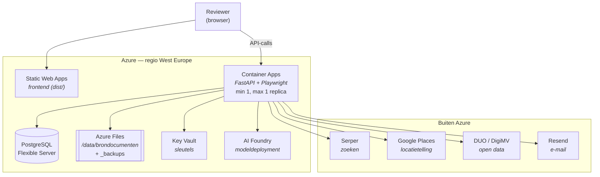

# KYC4etil op Azure — voorgestelde architectuur

*31 augustus 2026*

De werkbank draait nu op Railway. Productiesystemen moeten op termijn naar
Azure. Dit stuk beschrijft hoe dat eruitziet, wat er al klaar voor is en waar
het werk zit.

Uitgangspunt: er staat niets Railway-specifieks in de code. Het is een gewone
FastAPI-service, een PostgreSQL-database en een map statische bestanden. De
verhuizing is bouw- en configuratiewerk, geen herschrijving.

## Het plaatje

## Component voor component

| Nu (Railway) | Azure | Waarom deze |
|---|---|---|
| backend-service | **Container Apps** | Draait een eigen image, dus Chromium kan mee. Schaalt niet naar nul, wat hier nodig is. |
| frontend-service (`serve dist`) | **Static Web Apps** | Het is een gebouwde Vite-map. Een container ervoor is verspilling. |
| Railway PostgreSQL | **Azure Database for PostgreSQL — Flexible Server** | Zelfde Postgres, `DATABASE_URL` wijst er gewoon heen. |
| volume op `/data/brondocumenten` (88 MB / 5 GB) | **Azure Files**, gemount op hetzelfde pad | `documenten.py` en `backup.py` werken met een gewoon bestandspad. Mount je hem op dezelfde plek, dan verandert er niets. |
| omgevingsvariabelen met sleutels erin | **Key Vault** + Container Apps-secrets | Nu staan `OPENAI_API_KEY`, `SERPER_API_KEY` en `JWT_SECRET` als platte variabelen ingesteld. |
| OpenAI rechtstreeks | **AI Foundry-deployment** | Eén variabele om: `AZURE_OPENAI_ENDPOINT`. |

Regio **West Europe** (Amsterdam) — relevant als de vraag opkomt waar de
gegevens staan. Let op: modelbeschikbaarheid verschilt per regio, zie hieronder.

## Wat al klaar is

- **De modelprovider is omschakelbaar.** Alle modelaanroepen lopen door
  `maak_client()` in `backend/app/providers/llm.py`. Leeg endpoint = OpenAI,
  gevuld endpoint = Azure. Eén variabele, geen codewijziging. Dat is vorige
  week zo gebouwd, precies met het oog hierop.
- **Providers zitten achter Protocol-interfaces** (`app/providers/base.py`).
  Een dienst vervangen is één implementatie, niet een pipeline.
- **De code kent geen Railway.** Nul platformafhankelijkheden in `backend/app`.
- **De monitoring loopt via een knop**, niet via een cron buiten de app.

## Waar het werk zit

### 1. Een Dockerfile met Chromium — het grootste deel

`crawl4ai` en Playwright hebben een echte browser nodig. Railway lost dat nu
op met twee instellingen die je in geen enkele repository terugvindt:

- `RAILPACK_DEPLOY_APT_PACKAGES` met twintig X11- en font-bibliotheken
- `crawl4ai-setup` in de buildstap (`backend/railway.toml`)

Op Azure moet dat in een Dockerfile, die er nu niet is. De pakketlijst hebben
we — die staat in de Railway-variabelen en kan er rechtstreeks in. Reken op een
image van rond de 2 GB en een container met minstens 2 GiB geheugen.

### 2. Foundry is niet één-op-één OpenAI

Twee dingen om te controleren vóór de overstap, niet erna:

- **`model` is op Azure de deploymentnaam**, niet de modelnaam. `OPENAI_MODEL`
  staat nu op `gpt-5.6-luna`; op Azure wordt dat de naam die jij aan je
  deployment geeft.
- **Draait dat model daar?** Zo niet, dan wissel je van model — en dan moeten
  de prompts en `scripts.validate` opnieuw langs, inclusief de
  temperature-eigenaardigheid die luna heeft (`llm.py` vangt die nu af). Dat is
  een testronde, geen instelling.

### 3. Eén replica, niet nul en niet twee

De onderzoeksrun draait in het proces zelf, en de nachtelijke back-up hangt aan
een APScheduler in datzelfde proces. Dus:

- **niet naar nul schalen** — een container die tussendoor afschakelt, breekt
  een lopende run af;
- **niet meer dan één replica** — twee processen betekent twee back-ups per
  nacht en twee monitoringrondes.

Wil je later wél meerdere replica's, dan moet de planner eruit en wordt het een
losse Container Apps Job. Nu niet nodig.

### 4. Losse eindjes

- `FRONTEND_ORIGIN` (CORS) en `VITE_API_URL` (buildtijd) wijzen naar de
  Railway-URL's en moeten mee.
- De `DEMO_*_PASSWORD`-variabelen kunnen weg. Accounts worden sinds vorige week
  in de applicatie zelf beheerd; die variabelen zijn een restant van
  `seed_users.py`.
- `requirements.txt` pint geen versies. Bij Railway merk je dat pas als een
  build breekt; in een image wil je weten wat erin zit. Dit hoort vóór de
  verhuizing te gebeuren, niet erna.

## Zoeken blijft buiten Azure

Er is geen Azure-alternatief voor Serper dat bij ons past.

Microsoft heeft alle Bing Search-API's op 11 augustus 2025 uitgezet. De
opvolger, *Grounding with Bing Search* in AI Foundry, is geen hernoemd
endpoint: de oude API gaf een lijst zoekresultaten, grounding geeft een agent
webcontext en laat het model een antwoord formuleren.

Dat is voor ons de verkeerde kant op. `_serper_search` levert nu een kale lijst
URL's met titel en snippet, waarna onze eigen pipeline valideert, rankt en
scoort. Het uitgangspunt is dat de LLM een score alleen mag begrenzen, nooit
bepalen. Bij grounding doet het model de selectie en houden wij de uitkomst
over. Daar komt bij:

- **Prijs**: Microsoft noemt $14 per 1.000 transacties (oudere bronnen $35), en
  één vraag kan meerdere transacties kosten. Wij rekenen Serper op $1 per 1.000.
- **Toonplicht**: de Use and Display Requirements schrijven voor dat je de
  Bing-citaties én de link naar de Bing-zoekopdracht aan de eindgebruiker laat
  zien.

Serper laten staan is dus het voorstel. Hosting op Azure betekent niet dat elke
afhankelijkheid van Microsoft moet zijn: het is een HTTPS-call, die werkt vanaf
Container Apps net zo goed als vanaf Railway. Wat er naartoe gaat is een
zoekopdracht met een organisatienaam erin — geen persoonsgegevens, geen
documenten.

Moet Serper er tóch uit, dan zijn Brave Search API of Google Custom Search de
realistische vervangers, en dat is één functie in
`backend/app/providers/search.py`.

*Azure AI Search is iets anders, mocht die naam vallen: dat doorzoekt je eigen
documenten, niet het web.*

## Kosten, indicatief

| Onderdeel | Configuratie | Per maand |
|---|---|---|
| Container Apps | 1 vCPU / 2 GiB, altijd aan | ± $24 |
| Container Apps | 2 vCPU / 4 GiB, altijd aan | ± $47 |
| PostgreSQL Flexible Server | B1ms, 32 GB opslag | vanaf ± $12 + opslag |
| Static Web Apps | Free of Standard | $0 – $9 |
| Azure Files | 5 GB | enkele euro's |
| AI Foundry | per token, zoals nu | gelijk |

Grofweg **$40–$70 per maand** aan infrastructuur, plus het modelverbruik dat we
nu ook al betalen. Deze getallen zijn richtwaarden uit publieke prijspagina's —
laat ze door de Azure-prijscalculator lopen voordat je ze doorgeeft.

## Volgorde van uitvoeren

1. Versies pinnen in `requirements.txt`.
2. Dockerfile schrijven en **lokaal** draaien tot `scripts.ui_check` erdoorheen
   komt. Chromium is hier het risico; dat wil je niet in de cloud ontdekken.
3. Foundry-deployment aanmaken, `AZURE_OPENAI_ENDPOINT` zetten en
   `scripts.validate` draaien. Streefwaarden: coverage ≥70%, MAPE ≤10%,
   kalibratie ≥80%. Blijft dat staan, dan klopt het model.
4. Postgres opzetten, back-up van Railway terugzetten met
   `scripts/herstel_backup.py` in de lege database.
5. Container Apps + Azure Files + Key Vault inrichten.
6. Frontend naar Static Web Apps, `VITE_API_URL` en `FRONTEND_ORIGIN` omzetten.
7. Railway laten draaien tot Azure aantoonbaar werkt, dan pas afschakelen.

Stap 2 en 3 zijn de enige met echte onzekerheid. De rest is inrichten.

## Open vragen

- Draait `gpt-5.6-luna` in West Europe, of moeten we naar een andere regio of
  een ander model?
- Wie beheert de Azure-tenant en het abonnement — Etil zelf of via VVL?
- Blijft Serper staan, of is er een inkoopreden om ervan af te willen? Dat is
  een ander gesprek dan een technisch alternatief.
